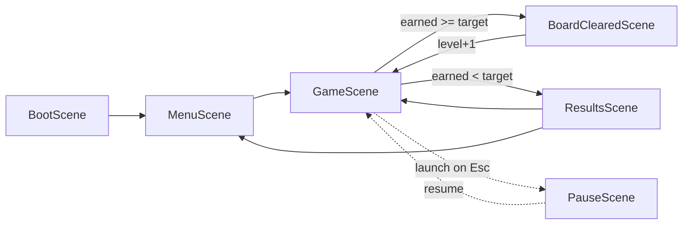

# Architecture

Map of the codebase: what each file owns, how a drop flows through the systems, and
where to make a given change. Written so a change can start at the right file instead
of a repo-wide grep. Keep it current when files are added, split, or given new
responsibilities — see "Docs are part of the change" at the end.

Stack: Phaser 4 (Matter physics) + Vite, plain JS ESM, no TypeScript, no linter.
Vitest covers the Phaser-free systems (`src/systems/*.test.js`): `CarryMultiplier`,
`BonusBallManager`, `Progression`, `ScoreManager`. Anything touching Matter or Phaser
rendering is playtested, not unit tested — keep new pure logic in `systems/` so it
stays testable.

## Directory map

```
src/
  main.js            Phaser.Game config, scene registry, dev window.game handle
  config/            gameConfig.js — every tunable constant in the game
  data/              narratorLines.js — barker dialogue pools (pure data)
  scenes/            Phaser scenes (screens + the gameplay orchestrator)
  systems/           gameplay logic, mostly Phaser-free and unit-testable
  ui/                procedural visuals (zero image assets)
  platform/          persistence behind a swappable adapter
public/audio         wav/ogg/mp3 SFX + music, preloaded by BootScene
public/fonts         Rye (signs) + Work Sans (HUD), loaded before first render
scripts/             offline dev helpers, not part of the game bundle
```

## Scene graph



`PauseScene` is **launched**, never started — `GameScene` stays alive underneath.
Every `scene.start('GameScene', …)` MUST pass `{ level, totalScore, carryMultiplier }`:
Phaser only overwrites stored scene data when the data argument is truthy, so a bare
start silently resumes the previous run's progression.

## File responsibilities

### Entry / config / data
| File | Owns |
| --- | --- |
| `src/main.js` | Phaser game config (FIT scale at 480×720, Matter gravity), scene order, `window.game` in dev only. |
| `src/config/gameConfig.js` | **All tuning.** Board size, `PHYSICS`, `PEG_FIELD`, `PEG_TEMPLATES` + `DEV_FORCE_TEMPLATE_ID`, `PEG_TYPES`, `SLOTS`, `PROGRESSION`, `CARRY`, `BONUS_BALLS`, `SESSION`, `NARRATOR`, `TIMED_DROP`, `BALL_STALL`, `JUICE`, `CARNIVAL` palette, `BOARD_CLEARED`/`RESULTS` timings, `STORAGE_KEY`. Balance changes belong here, not in scene code. |
| `src/data/narratorLines.js` | Four line pools: below-threshold, above-threshold, fail/hazard, board-cleared (`{level}` placeholder). Pure strings. |

### Scenes
| File | Owns |
| --- | --- |
| `BootScene.js` | Preloads every audio key (uses `import.meta.env.BASE_URL`), awaits both webfonts, starts `MenuScene`. Add new SFX keys here. |
| `MenuScene.js` | Title sign, house-record stub (read via platform adapter), rules blurb, START GAME, sound/music toggles, intro music with fade in/out, "reset player data" link. |
| `GameScene.js` | **The orchestrator** (largest file). Builds peg field + slot sensors + floor + walls, instantiates every system, dispatches collisions, owns ball lifecycle, the stall watchdog `update()`, all juice (particles/shake/flash/popups/shockwave), and board advancement. |
| `BoardClearedScene.js` | 3s interstitial; passes `level+1`, total score and carried multiplier straight through to a fresh `GameScene`. |
| `ResultsScene.js` | Final take, boards cleared, high-score compare/save, NEW HOUSE RECORD reveal, ONE MORE / MIDWAY. |
| `PauseScene.js` | Overlay on the paused GameScene; resume, quit to menu, audio toggles (music toggle reaches into `GameScene.gameMusic` directly). |

### Systems (`src/systems/`)
| File | Owns | Phaser? | Tested |
| --- | --- | --- | --- |
| `PegField.js` | `createPegField(scene)`: pick/mirror a template, center its bounding box, jitter positions, shuffle-assign peg types by `count`, stamp textures, create static Matter bodies, attach per-peg data (`points`, `carryBoost`, `hits`, `isSpecial`), add hazard glow/shiver tweens. Throws if a template has fewer open cells than the special pegs need. | yes | no |
| `CarryMultiplier.js` | The durable boost: `applyBoost(base, priorHits)`, `payout(points)`, `carryOver()`. All three damping rules live here (`repeatHitFactor`, `payoutFraction`, `carryOverFraction`, `max`). | no | yes |
| `BonusBallManager.js` | Two bonus-ball sources against one session cap: `evaluateZone(grants)` and `evaluateScoreThreshold(earnedThisBoard)`, the latter gated on a fraction of the *current board's* target. | no | yes |
| `Progression.js` | `thresholdForLevel(level)` — the geometric per-board earn target from `PROGRESSION`. | no | yes |
| `ScoreManager.js` | Running total + its text object. `add`, `reset`, `format`. | text only | yes |
| `DropController.js` | Horizontal aim + release. Two modes via `TIMED_DROP.enabled`: auto-sweep-and-tap (current) or drag-to-aim. Renders the brass chute indicator and dashed drop line; fires `onDrop(x)`. `setEnabled` gates input while a ball falls. |  yes | no |
| `NarratorSystem.js` | Drop-counted random barker lines from the threshold pools, `show(line)` for one-off callouts (near miss, fail), 3s auto-clear, `onChange` so the HUD can fade its sign. | yes | no |
| `AudioFeedback.js` | Named cue methods only — `pegHit`, `specialPegHit`, `deadBallHit`, `scoreHit(carryStep)`, `ballPop`. Mixes sampled playback with procedural Web Audio oscillators. Game logic never calls `sound.play` for feedback. | yes | no |
| `AudioSettings.js` | `isSoundOn`/`isMusicOn`/`toggleSound`/`toggleMusic`, persisted to localStorage. Deliberately *not* platform-adapter data — these are local UI prefs. | no | no |

### UI (`src/ui/`)
| File | Owns |
| --- | --- |
| `carnival.js` | The shared procedural kit: `signText`/`hudText`, `tentBackdrop`, `valance`, `bulbString`, `marqueeFrame`, `signPanel`, `ticketButton`, `toggleButton`, `sway`, `chains`, `woodPost`, `vignette`, `gradientRect`, `lerpColor`/`shade`, and the two peg texture generators (`makePegTexture`, `makeHazardPegTexture`, supersampled — stamp with `PEG_TEXTURE_SCALE`). Also the font constants. |
| `GameHud.js` | GameScene chrome only, no gameplay state: backdrop/vignette/posts, header plaques (`updateBoard`, `updateBalls`), hanging barker sign (`setBarkerVisible`, `setBarkerBelowThreshold`, `attachBarkerText`), slot booth framing (`decorateSlots`, `slotLabel`), bottom rail. Exports `DEPTH = { chrome 5, label 6, effect 15, ball 20 }`; play field stays at 0, backdrop negative. |

### Platform (`src/platform/`)
`PlatformAdapter.js` is the abstract async interface (`init`, `getHighScore`,
`setHighScore`, `clearData`). `LocalStorageAdapter.js` is the live implementation and
swallows all storage errors. `CrazyGamesAdapter.js` is an unwired stub. `index.js`
exposes `getActiveAdapter()` — **the single switch point**; swap the constructor there
rather than branching at call sites.

## Control flow of one drop

1. `DropController` sweeps/aims, release calls `GameScene.spawnBall(x)`.
2. `spawnBall` clears the narrator, sets `ballInPlay`, disables the controller, creates the Matter ball, resets stall state.
3. `matter.world 'collisionstart'` → `handleCollisions`. Only pairs involving `this.currentBall` count; the `ballInPlay` guard makes a ball resolve at most once per drop.
   - `peg` with negative points → `failDrop` (penalty, popup, burst, shockwave, shake, flash, fail line) → `finishBall`.
   - `peg` otherwise → flat points, `carry.applyBoost(boost, hits)` with the per-peg `hits` counter, reward popup for special pegs, cue + small shake.
   - `slot-<value>` → `checkNearMiss(x)` then `resolveDrop(value, grantsBonusBall)`.
   - `floor` → `resolveDrop(0, false)` (safety net; walls exist for the same reason).
4. `resolveDrop`: `carry.payout(points)` → score, burst/shake/cue, bonus-ball evaluation against **earnings on this board**, `finishBall`.
5. `finishBall`: destroy ball, decrement balls, `narrator.onDrop`, then re-enable input or `endBoard`.
6. `endBoard`: `earned >= thresholdForLevel(level)` → `BoardClearedScene` with `carry.carryOver()`, else `ResultsScene` after `RESULTS.delayMs`.

`GameScene.update` is only the stall watchdog: if the ball makes less than
`BALL_STALL.minProgress` px downward per check, nudge once, then force-resolve as a
0-point floor hit so a wedged ball can't hang the session.

## Where to change what

| Change | Go to |
| --- | --- |
| Any balance number (scores, thresholds, counts, timings, juice, palette) | `config/gameConfig.js` |
| New board silhouette | `PEG_TEMPLATES`; pin it with `DEV_FORCE_TEMPLATE_ID` while iterating (never commit non-null) |
| New peg tier / behaviour | `PEG_TYPES` + `PegField.pegTextureFor`, and `carryBoostFor`/`pointsFor` if it scores differently |
| Slot count/values/free-ball zones | `SLOTS.zones` (GameScene derives slot width and the top-tier zone from it) |
| Board targets / difficulty curve | `PROGRESSION` + `systems/Progression.js` |
| Multiplier economy | `CarryMultiplier.js` + `CARRY` |
| Bonus-ball rules | `BonusBallManager.js` + `BONUS_BALLS` |
| Barker dialogue | `data/narratorLines.js`; cadence in `NARRATOR` |
| New sound | add the key in `BootScene.preload`, expose a named method on `AudioFeedback` |
| HUD chrome / layout | `ui/GameHud.js`; shared widgets in `ui/carnival.js` |
| Screen layout / copy | the relevant scene in `src/scenes/` |
| Persistence backend | `platform/index.js` (`getActiveAdapter`) |
| Drop input feel | `DropController.js` + `TIMED_DROP` |
| Deploy path / base URL | `vite.config.js` (`base: '/UnderConstruction/'`) and `.github/workflows/deploy.yml` |

## Conventions and traps

- **Tune in config, not code.** If a change is a number, it belongs in `gameConfig.js`.
- **Keep gameplay logic in `systems/`.** GameScene wires things together; it should not
  grow new rules. New pure logic goes in a system with a vitest file next to it.
- **Systems that touch Matter are not unit-testable** — hand those to the user to
  playtest rather than writing a fake physics harness.
- **Visuals are procedural.** No image assets; add shapes to `carnival.js` and reuse.
- **Depth discipline:** use `DEPTH` from `GameHud.js`; the ball must stay above chrome.
- **Peg legibility hierarchy is deliberate:** muted brass base → bronze/silver/gold/
  diamond reward ladder → the one black/yellow/red spiked hazard. No reward tier is ever
  red or black, so "avoid this" stays unambiguous.
- **`import.meta.env.DEV` guards the debug keys** in GameScene (`S` barker sign, `B`
  board-cleared jump) — they are stripped from production builds.
- **Docs are part of the change.** This file describes the code's structure;
  [README.md](README.md) describes the gameplay rules in plain English and is a direct
  rendering of `gameConfig.js`. Update ARCHITECTURE.md whenever a file is added, split,
  removed, or takes on a new responsibility, or the scene graph / drop flow changes.
  Update README.md in the same commit whenever balance, scoring, progression, or
  controls change. Both are checked before code is investigated, so a stale doc actively
  misleads.
